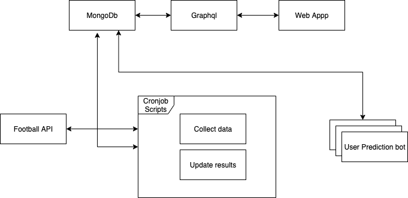

# Gepick 

Ecosystem for soccer prediction bot developers and prediction users. It allows developers to upload predictions bots. Gepick exposes endpoints for soccer data. Bots communicating ussing http protocol, it allows to use of any programing language. Predictions are shared with users using web app.

This repo contains multi projects:

`@gepick/back-graphql`
`@gepick/cronjobs` 
`@gepick/front-web`
`@gepick/scripts`

Idea behind this is to create mono repo in witch all projects could be developed and deployed using here shared components and other logic base. This project was created by one person, multirepo hellped for smooth developing. 

## Project architecture

